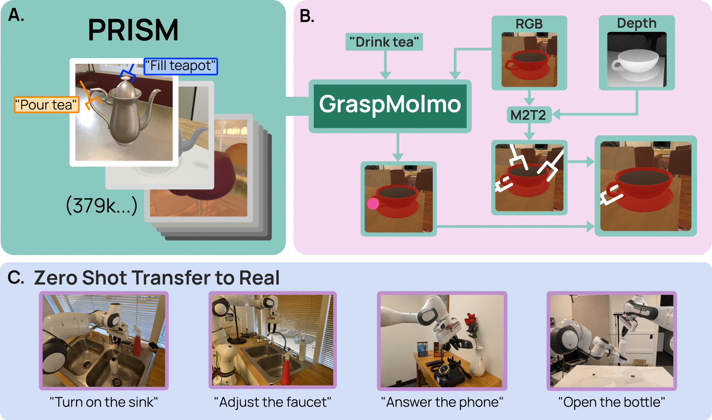

# GraspMolmo

[[Paper]](https://arxiv.org/pdf/2505.13441) [[arXiv]](https://arxiv.org/abs/2505.13441) [[Project Website]](https://abhaybd.github.io/GraspMolmo/) [[Data]](https://huggingface.co/datasets/allenai/PRISM) [[Model]](https://huggingface.co/allenai/GraspMolmo)

Code and website for "GraspMolmo: Generalizable Task-Oriented Grasping via Large-Scale Synthetic Data Generation"



## Generating new data + TaskGrasp-Image

See [DATA.md](DATA.md) for details on generating new data and TaskGrasp-Image.

## Setup

Using a virtualenv (e.g. conda) is highly recommended! This code is tested on Python 3.11, but likely works on other versions.

To install this codebase:
- For data generation: `pip install -e .[datagen]`
- For TaskGrasp-Image generation: `pip install -e .[taskgrasp-image]`
- For only GraspMolmo inference: `pip install -e .[infer]`
- For all of the above: `pip install -e .[all]`

See [DATA.md](DATA.md) to understand the released data and how to generate more, if needed.

## Inference

To use GraspMolmo to predict grasps, refer to the following sample:

```python
from graspmolmo.inference.grasp_predictor import GraspMolmo

task = "..."
rgb, depth = get_image()
camera_intrinsics = np.array(...)

point_cloud = backproject(rgb, depth, camera_intrinsics)
# grasps are in the camera reference frame
grasps = predict_grasps(point_cloud)  # Using your favorite grasp predictor (e.g. M2T2)

gm = GraspMolmo()
idx = gm.pred_grasp(rgb, point_cloud, task, grasps)

print(f"Predicted grasp: {grasps[idx]}")
```
